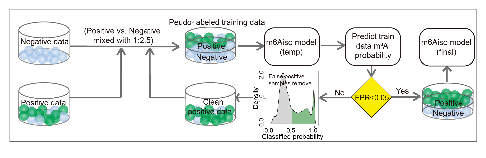

# m6Aiso


m6Aiso is a convolutional neural network (CNN)-based model designed for the detection of m6A modifications from nanopore direct RNA sequencing data. The model is developed by leveraging endogenously labeled m6A-modified signals and a semi-supervised framework.

# Table of Contents
- **[Running m6Aiso](#running-m6aiso)**<br>
    - **[Requirements](#requirement)**<br>
    - **[Installation](#installation)**<br>
    - **[Data Prepare](#data-prepare)**<br>
    - **[m6A Prediction](#m6A-prediction)**<br>
    - **[Model Training](#semi-supervised-model-training)**<br>
- **[Getting Help](#getting-help)**<br>
- **[Contacts](#contacts)**<br>
- **[Citing](#citing-m6aiso)**<br>
- **[Contributors](#contributors)**<br>
- **[License](#license)**<br>

# Running m6Aiso

## Requirements

1. pytorch v1.13.0+cu116
2. Nanopolish v0.13.2
3. Python v3.7
4. numpy v1.20.1
5. sklearn v0.24.1
6. pandas v1.2.4

## Installation
m6Aiso requires [Python version 3.7 or higher](https://www.python.org). To install the latest release with PyPI (recommended) run

```sh
$ pip install m6Aiso
```

## Data preparation

m6Aiso relies on the output from Nanopolish eventalign function, which segments the continuous ionic current signals from each read into 5-mer events and provides their corresponding transcriptome coordinates:
```
    nanopolish eventalign 
                            --reads <in.fasta> 
                            --bam <in.bam> 
                            --genome <transcriptome.fa> 
                            --signal-index
                            --scale-events 
                            --summary <summary.txt> | gzip > <out.tsv.gzip>
```
*Note: Please provide the transcriptome reference instead of the genomic reference.

After running nanopolish eventalign, you can extract features (including the mean, standard deviation and dwell time) for the 5-mers at DRACH sites, as well as the features from one-base-pair flanking the DRACH sites using 'm6Aiso current_signal_abstract_for_m6A_pred':

```
    python -m m6Aiso current_signal_abstract_for_m6A_pred 
                            --nanopolish_result <out.tsv.gzip>
                            --number <the number of each batchs>
                            --out_dir /path/to/output
```

The output files are stored in ``/path/to/output``:


## m6A prediction

In this step, you can predict the modification probability at each DRACH site for each read based on the features obtained from last step and m6Aiso model. Please run:

```
    python -m m6Aiso molecular_m6A_predication 
                            --using_signal_filename <signal.tsv>
                            --predict_result_filename <molecular_m6A_prob.txt>
```

The double cutoffs 0.9 and 0.1 are recommended. A sites within a read is considered as modified if its predicted modification probability exceeds 0.9, and it is considered as unmodified if the predicted modification probability is below 0.1.

## Semi-supervised model training

If you want to train a new model based on semi-supervised framework, you can run `m6Aiso semi_supervised_model_train` based on the data prepared by yourself:
```
    python -m m6Aiso semi_supervised_model_train
                            --model_name <AttentionNet,Res1dNet,Res2dNet>
                            --orginal_pos_filename <modified_signal.tsv>
                            --orginal_neg_filename <unmodified_signal.tsv>
                            --max_value_filename 
                            --min_value_filename
                            --out_dir
```

# Getting help

We appreciate your feedback and questions! You can report any errors or suggestions related to m6Aiso as an issue on [github](https://github.com/Jinkai-Wang-Lab-epitranscriptomics/m6Aiso/issues).

# Contacts

Jinkai Wang: wangjk@mail.sysu.edu.cn
Wenbing Guo: guowb9@mail2.sysu.edu.cn
Zhijun Ren: renzhj7@mail.sysu.edu.cn

# Citing m6Aiso

If you use m6Aiso in your research, please cite
[Guo., W., Ren., Z., Huang., X., He., J., Zhang., J., Wu., Z., Guo., Y., Zhang., Z., Cun., 
Y., and Wang., J. (2024). Endogenous labeling empowers accurate detection of 
m6A from single long reads of direct RNA sequencing. bioRxiv](https://doi.org/10.1101/2024.01.30.577990)


# Contributors

This package is developed and maintaned by Jinkai Wang, Wenbing Guo and [Zhijun Ren](https://github.com/ZJRen9). If you want to contribute, please leave an issue or submit a pull request. We appreciate contributions on bug fixes and potential new features. Thank you!

# License
m6Aiso is licensed under the terms of the MIT license.
